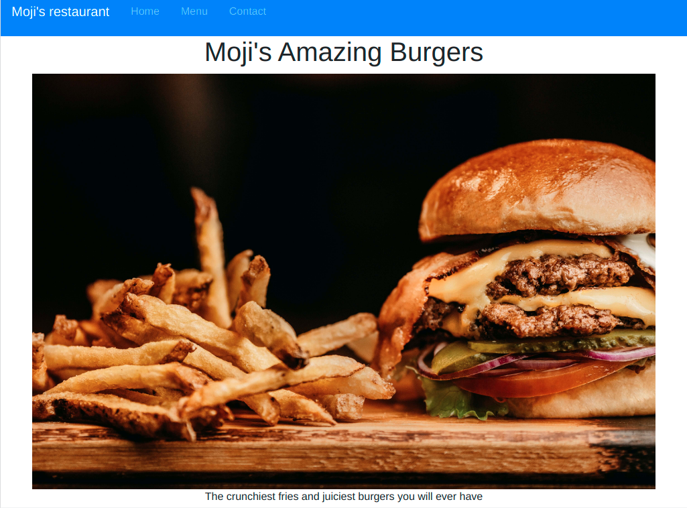
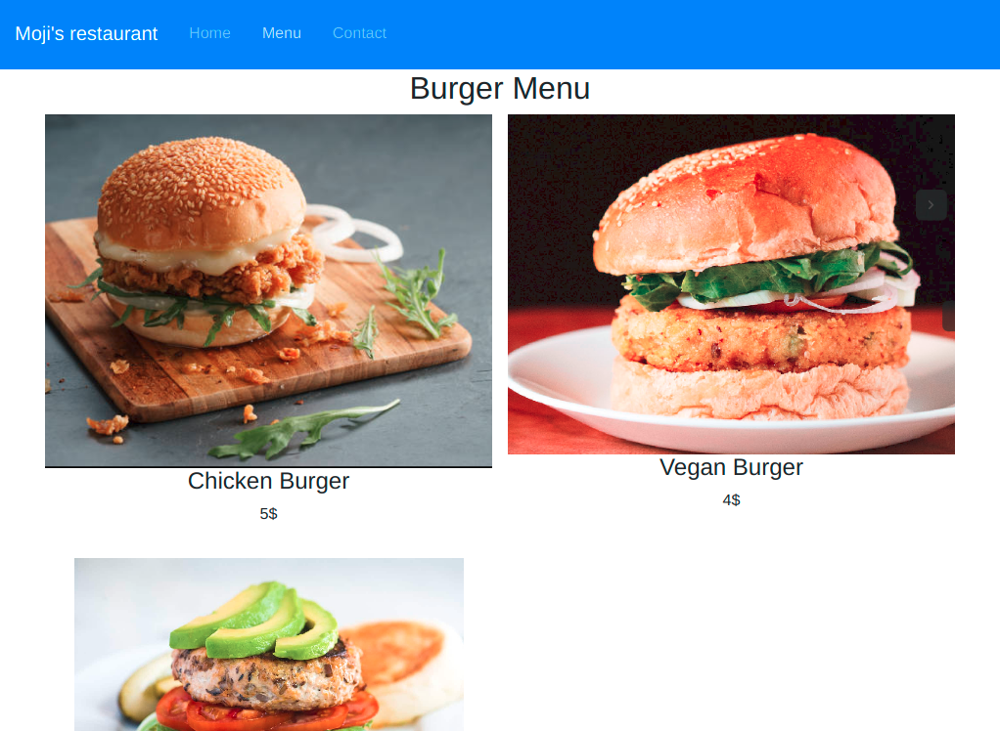
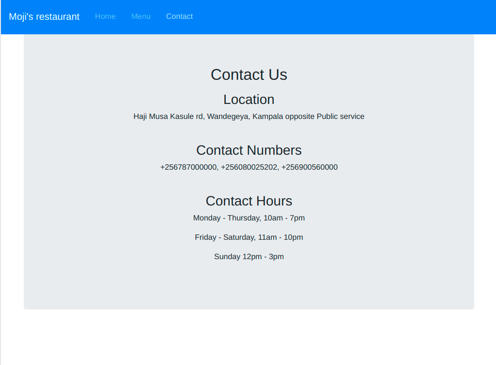

# restaurant-page


> A website built using purely DOM manipulation and event handling to create a resturant page and bundle it up using Webpack for a Modern JavaScript touch. Webpack is used for Asset management of the images, pre-loading the CSS and bundling the different imported JavaScript modules.
DOM scripting manipulates various elements and a user is able to view the home page, menu and contact pages all in a Single Page Application.

### The 3 pages

|  | |  | 
|:---:|:---:|:---:|
| Home Page | Menu Page | Contact Page |

## Built With

- HTML5 & CSS3, & JavaScript
- Bootstrap

## Live Demo

[Live Demo Link](https://kabohajeanmark.github.io/restaurant-page/)

## Instructions
To get a local copy up and running follow these simple example steps.

### Prerequisites
- Gitbash installed to navigate between the branches.
- A preferred text editor for example VS Code.
- A browser such as Google Chrome

### Install
Clone this [GitHub Repo](https://github.com/KabohaJeanMark/restaurant-page/) to your computer on yourFolder by typing these commands in the terminal or download as a Zip file and extract.
```
$ mkdir yourFolder
$ cd yourFolder
$ git clone https://github.com/KabohaJeanMark/restaurant-page/

```

### Using webpack
- Install the packages locally and run the command to modify your bundled js based on changes in the JavaScript file.
```
npm install
npm run dev
```
- Run the following command so that webpack to always watch your changes and updates your modified js whenever changes are made to the index.js or it's module files it is importing from
```
npm run watch
```

### Usage
- View with live Server in VS code or Right click and open the index.html in your browser to view.

## Author

👤 **Kaboha Jean Mark**

- GitHub: [@KabohaJeanMark](https://github.com/KabohaJeanMark)
- Twitter: [@jean_quintus](https://twitter.com/jean_quintus)
- LinkedIn: [Jean Mark Kaboha](https://www.linkedin.com/in/jean-mark-kaboha-software-engineer/)


## 🤝 Contributing

Contributions, issues, and feature requests are welcome!

Feel free to check the [issues page](https://github.com/KabohaJeanMark/restaurant-page/issues).

## Show your support

Give a ⭐️ if you like this project!

## Acknowledgments

- Hat tip to Microverse for the README template, instructions and tutoring for this Capstone project.

## 📝 License

This project is [MIT](./LICENSE) licensed.